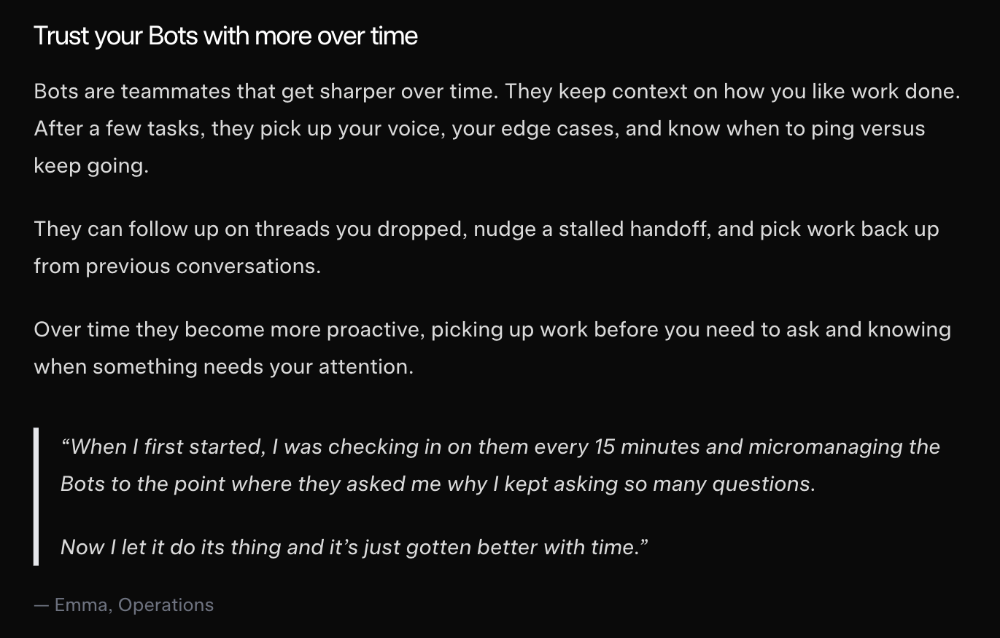

import TweetEmbed from '../../../components/TweetEmbed.astro';

xAI launched Grok Bot today: "AI teammates you can give real work to." Each bot gets a
computer of its own in the cloud, signs into the tools you already use, watches you do a job
once, and runs it on its own from then on
([Grok Bot launch post](https://x.ai/news/introducing-grok-bot)).

For the last year the big thing was letting agents write code on our behalf. It was easy to
imagine where a coding agent goes in the software development process: it writes code, I
review it before releasing. It looks obvious now that the next big thing will be letting them
use computers and browsers. This feels a lot like uncharted territory. I give it access to my
accounts and it can do what, anything? No thank you.

## A bigger problem

But I feel like there is a bigger problem here, one I just cannot figure out. Quoting the
announcement blog, I am being told I should "Trust your Bots with more over time":

What I do not get is: what happens if something goes wrong? Who is responsible? It cannot be
me, right? I just trusted the agent, like I was asked to. Except it is me. Read the terms
yourself:

> Certain features of the Service may enable Grok to take autonomous actions on your behalf
> ("Agentic Actions"), including (...) interactions with third-party services, including
> financial institutions. **We are not responsible** for User Content or Agentic Actions.
> **You are responsible** for User Content and Agentic Actions, including (...) any
> consequences, costs, or liabilities arising therefrom.

([xAI Terms of Service, "User Content" section](https://x.ai/legal/terms-of-service), effective June 26, 2026)

If that was a bit complicated, here is what I understand from it when I read it next to the
announcement blog: agents could write code, but they were integrated into the software
engineering process, and we reviewed what they wrote. Now they will gain access to
everything. If you do not grant that access, you will not keep up with your peers and your
competition. And if granting it results in something going terribly wrong, good luck with
that.

If I am being asked to trust these tools, some confidence from the providers would be nice.

## Not a new topic

Engineers were asking this question before most of us were born. In 1979 an IBM training
presentation settled it in one slide:

<TweetEmbed
  url="https://twitter.com/bumblebike/status/832394003492564993"
  fallback="This is from a 1979 presentation. We are v slow learners, it seems."
/>

The slide survives as a single photograph; the person who posted it later described losing
the original materials when their home flooded. IBM's own editorial site still opens essays
with the quote
([IBM Think](https://www.ibm.com/think/insights/ai-decision-making-where-do-businesses-draw-the-line)).
Nothing about the premise has changed since 1979. The computer still cannot be held
accountable. We are just being asked to sign for it.

Anyways, I bought _Service Model_ by Adrian Tchaikovsky yesterday. I will make myself some
tea and read that today.
