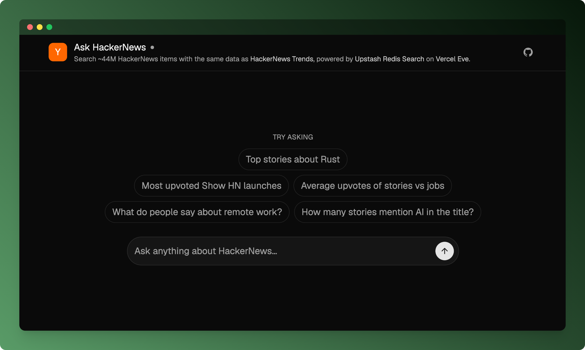
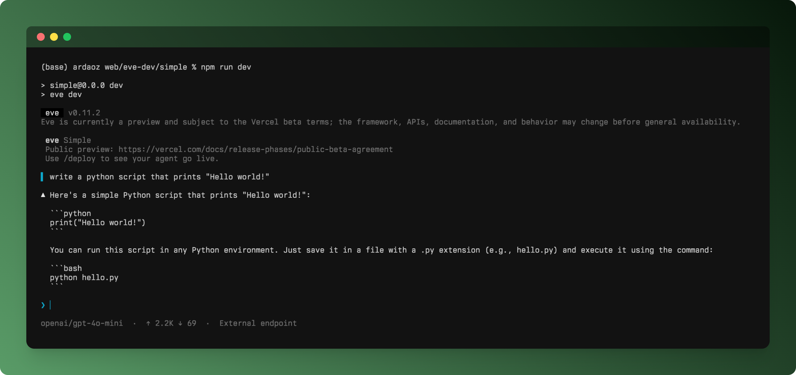
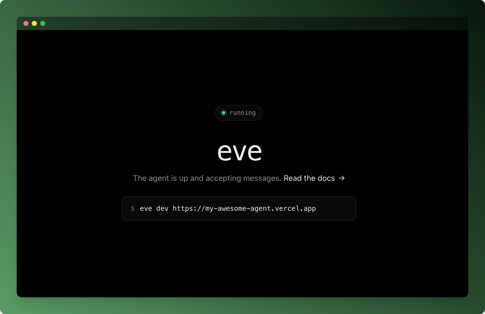

import TweetEmbed from '../../../components/TweetEmbed.astro';

# A tour of Vercel Eve

I built [Ask HackerNews](https://github.com/upstash/eve-example), an agent that
searches HackerNews, on [Vercel Eve](https://vercel.com/eve).



Vercel just released Eve, their framework for building agents:

<TweetEmbed
  url="https://x.com/vercel/status/2067180054979936413"
  fallback="Vercel announcing Eve, their framework for building agents."
/>

The pitch is "like Next.js for web apps, but for agents": Markdown for instructions
and skills, TypeScript for tools, durable by default. This post is about the
framework rather than the [Ask HackerNews](https://github.com/upstash/eve-example) app.
About what it is like to build, schedule, and ship an agent with it.

## Initializing a project

Eve is filesystem-first: you scaffold a project, then add capabilities as files
under `agent/`. Initialize a pure agent, one you call over HTTP, with:

```bash
npx eve@latest init my-agent
```

To get a Next.js app along with the agent, add `--channel-web-nextjs`:

```bash
npx eve@latest init my-agent --channel-web-nextjs
```

See the [Next.js and Eve guide](https://eve.dev/docs/guides/frontend/nextjs) for
how the two fit together.

## Where things live

A minimal agent is two files: `agent/agent.ts` for runtime config and
`agent/instructions.md` for the system prompt.

```ts
// agent/agent.ts
import { openai } from "@ai-sdk/openai";
import { defineAgent } from "eve";

export default defineAgent({
  model: openai("gpt-5.4-mini"),
});
```

From there, each kind of capability has its own place on disk:

```txt
agent/
  agent.ts          # model + runtime config
  instructions.md   # the always-on system prompt
  tools/            # one TypeScript file per tool
  skills/           # load-on-demand markdown procedures
  connections/      # MCP / OpenAPI connections
  channels/         # where the agent is reachable (HTTP, Slack, ...)
  lib/              # shared code your tools import
app/                # Next.js chat UI (with --channel-web-nextjs)
next.config.ts      # withEve(...)
```

## Running `eve dev`

`eve dev` runs the agent locally with an interactive
[terminal UI](https://eve.dev/docs/guides/dev-tui). You type a message and watch
the loop: tool calls, results, reasoning, the reply.



## Empowering the agent: tools, skills, and connections

A tool is a typed action. The filename becomes the tool name.

```ts
// agent/tools/get_weather.ts
import { defineTool } from "eve/tools";
import { z } from "zod";

export default defineTool({
  description: "Get the current weather for a city.",
  inputSchema: z.object({ city: z.string() }),
  async execute({ city }) { /* … */ },
});
```

If you have used the AI SDK, this will look very familiar; it mirrors how you
[define tools](https://ai-sdk.dev/docs/ai-sdk-core/tools-and-tool-calling) there.

[Skills](https://agentskills.io/home) live as markdown files under `agent/skills/`.
Eve pulls one into the model's context only when a task calls for it.

For external systems there are [connections](https://eve.dev/docs/connections). MCP is supported, and there is also
[`defineOpenAPIConnection`](https://eve.dev/docs/connections): give it an OpenAPI
document and Eve turns each operation into a tool, handling auth so the model never
sees your tokens.

```ts
import { defineOpenAPIConnection } from "eve/connections";

export default defineOpenAPIConnection({
  url: "https://api.example.com/openapi.json",
  // auth handled by Eve; the model just sees the operations
});
```

I had [built something similar before](https://github.com/CahidArda/spec2tools),
so it was good to see this as a built-in.

There is an experimental
[`codeMode`](https://eve.dev/docs/agent-config#other-defineagent-fields) flag too.
Instead of separate tool calls, the model writes JavaScript that calls the tools
in the sandbox. The idea comes from Cloudflare's
[Code Mode](https://blog.cloudflare.com/code-mode/); I had tried a version of it in
spec2tools' [code mode](https://github.com/CahidArda/spec2tools#code-mode) on top
of [pydantic/monty](https://github.com/pydantic/monty). It is experimental in Eve,
but worth watching.

## Periodically running the agent: schedules

Eve agents can run on a [schedule](https://eve.dev/docs/schedules), not only in
response to a request.

Lately I keep hearing about [loops and schedules](https://code.claude.com/docs/en/scheduled-tasks)
as something of a hidden gem. Just today I listened to Boris Cherny, the creator of
Claude Code, [talk about](https://youtu.be/SlGRN8jh2RI?si=TQ9__wleDtdbdy-5&t=472)
running dozens of them to babysit his PRs, fix flaky CI, and cluster his feedback. I
plan to lean on them more in my own work, and Eve should make that easier.

## Communicating with the agent: channels

Every Eve app exposes an HTTP channel, and you can add platform
[channels](https://eve.dev/docs/channels/overview): Slack, Discord, Telegram, and a
web chat. The same agent is reachable from each one.

```ts
// agent/channels/eve.ts
import { eveChannel } from "eve/channels/eve";
import { localDev, vercelOidc, none } from "eve/channels/auth";

export default eveChannel({ auth: [localDev(), vercelOidc(), none()] });
```

## Deploying the Agent to Vercel

Update the Vercel CLI first; I hit deploy errors that came down to an old version.
Then deploy with:

```bash
vercel
```

If you initialize Eve as a pure agent (without a Next.js app) and open it, the page
shows you how to connect to the agent using Eve.



You may want to check the
[auth and route protection](https://eve.dev/docs/guides/auth-and-route-protection)
page if you are going to deploy agents to production.

## The Agent Stack

I didn't have to piece this together myself. Vercel frames it directly: they call
their agent building blocks "the Agent Stack," and Eve wires them up with a single
command.

<TweetEmbed
  url="https://x.com/vercel/status/2067176489641275824"
  fallback="Vercel on the Agent Stack: the building blocks Eve implements with one command."
/>

Here is how each block shows up in an Eve project:

- AI SDK: the model loop, tool calling, and the
  [terminal UI](https://ai-sdk.dev/v7/docs/ai-sdk-harnesses/terminal-ui), following
  the [AgentHarness](https://ai-sdk.dev/v7/docs/ai-sdk-harnesses/harness-agent) in
  [AI SDK v7](https://vercel.com/changelog/program-agent-harnesses-with-ai-sdk).
  Many of its
  [settings](https://ai-sdk.dev/v7/docs/ai-sdk-harnesses/harness-agent#settings) are
  Eve options too, such as [skills](https://eve.dev/docs/skills),
  [instructions](https://eve.dev/docs/instructions), and
  [hooks](https://eve.dev/docs/guides/hooks).
- AI Gateway: model access and routing. The default model goes through the
  [gateway](https://vercel.com/docs/ai-gateway).
- Workflow SDK: durable, resumable sessions on
  [Vercel Workflows](https://vercel.com/workflows).
- Sandbox: agent code runs in a [Vercel Sandbox](https://vercel.com/docs/sandbox),
  which is also where `codeMode` executes.
- Chat SDK: the web chat channel comes from [Chat SDK](https://chat-sdk.dev/).
- Vercel Connect: [connections](https://eve.dev/docs/connections) to external
  systems, over MCP or OpenAPI.

## Conclusion

Setup was quick and I ran into few problems. It was good to see this much of
Vercel's recent work come together behind a filesystem-first project you can read
top to bottom.

The full app is on GitHub:
[`upstash/eve-example`](https://github.com/upstash/eve-example).
